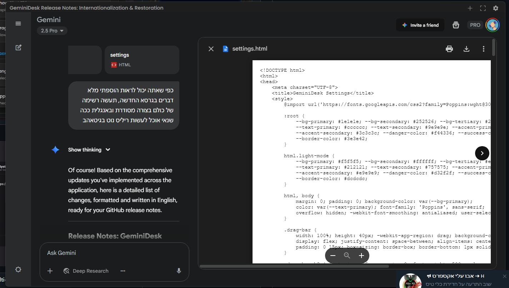
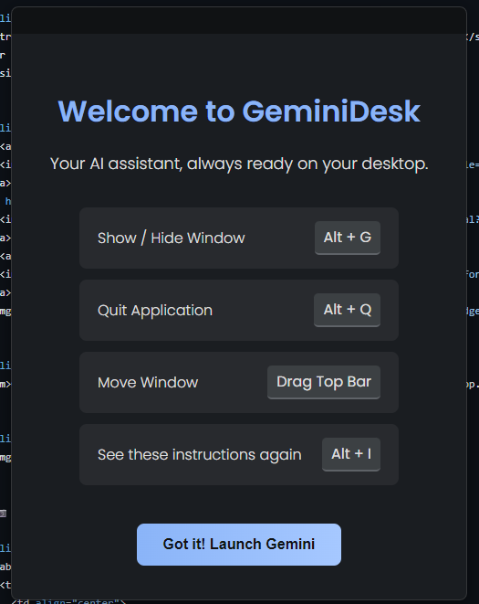
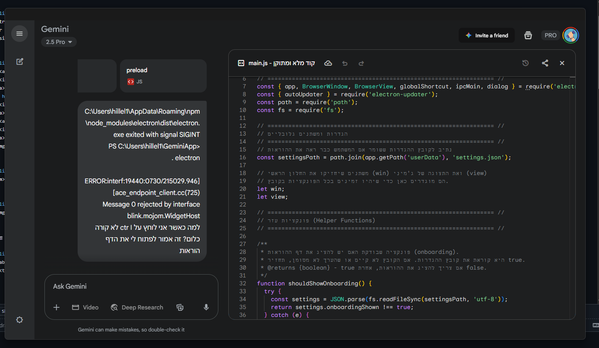
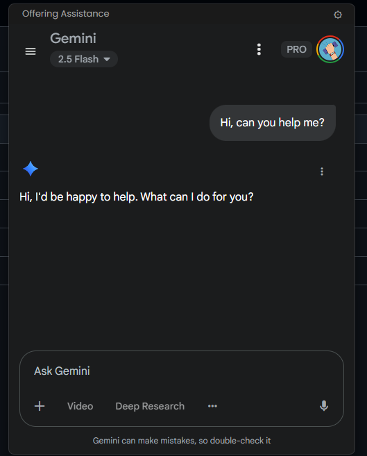
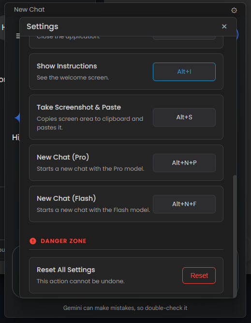
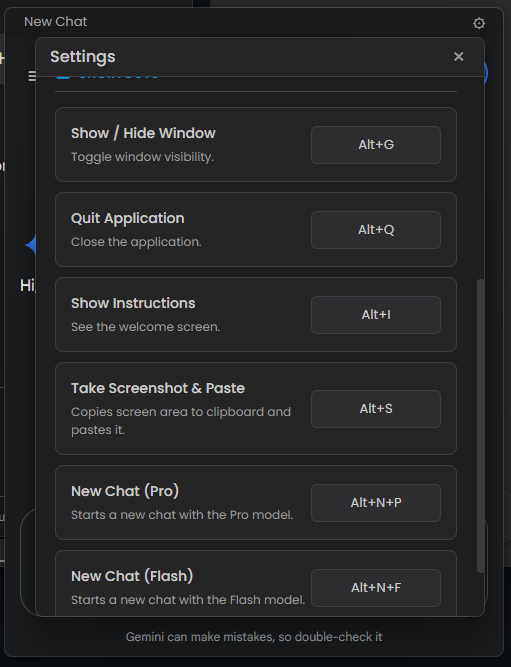
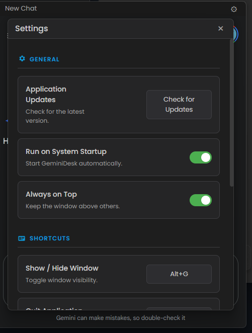

<p align="center">
  
</p>

<h1 align="center">🚀 GeminiDesk - The Unofficial Gemini Desktop App 🚀</h1>

<p align="center">
  <strong>Is Google Gemini just another browser tab in your sea of tabs? We fixed that.</strong>
  <br />
  GeminiDesk liberates the brilliant Google Gemini AI, giving it a proper home on your desktop. This is the native, feature-packed Gemini desktop app you've been searching for.
</p>

<p align="center">
    <a href="https://github.com/hillelkingqt/GeminiDesk/releases/latest">
    
  </a>
  <a href="https://github.com/hillelkingqt/GeminiDesk/releases">
    
  </a>
    <a href="https://github.com/hillelkingqt/GeminiDesk/issues">
    
  </a>
  
  
</p>

<p align="center">
  <em>GeminiDesk transforms your AI interaction from a clumsy browser dance into a native desktop symphony. No more clutter. No more distractions. Just pure, unadulterated productivity with a sprinkle of magic.</em>
</p>

---

## ✨ Why Settle for a Tab When You Can Have a Throne? ✨

GeminiDesk is more than a wrapper. It's a command center, loaded with features that will make you wonder how you ever lived without them.

### 🌐 International & Accessible
*   **Multi-Language Support:** GeminiDesk speaks your language! The entire UI is translated into over 20 languages, with automatic language detection and full right-to-left (RTL) support for languages like Hebrew and Arabic. You can also select your language manually.

### 🧠 Core AI & Workflow Features
*   **📸 Screenshot to Chat:** Instantly snip any part of your screen with a hotkey. The image is magically beamed into your chat, ready for Gemini's brilliant analysis.
*   **📁 Universal File Drop:** Drag and drop images, PDFs, text files—almost any file—directly into the app. It's instantly ready for upload.
*   **⚡️ Instant Model Switching:** Use dedicated hotkeys to instantly fire up a new chat with either the lightning-fast **Flash** model or the powerhouse **Pro** model.
*   **🔎 Instant Chat Search:** Lost a brilliant idea in the chat abyss? Hit the search hotkey to immediately focus the search bar and unearth your past conversations.
*   **🤝 "Open With" Integration:** Set GeminiDesk as the default application for images or text files. Opening a file with the app will instantly load it into the chat.

### ⚙️ Powerful Window & Session Management
*   **🔄 Session & Window Restoration:** Never lose your place again! Enable a setting to remember all your open windows and their positions. Upon restart, all chats are fully restored.
*   **✨ Multi-Window Mania:** Who said you can only have one conversation at a time? Open multiple windows and conquer multiple topics simultaneously.
*   **📌 Always-On-Top Mode:** Keep Gemini watching over your shoulder while you work. Perfect for coding, writing, or just feeling less alone.
*   **🖼️ Canvas Mode:** Instantly expand the window to a larger, more comfortable size, perfect for deep dives and extensive conversations.
*   **🖥️ Fullscreen & Custom Header:** Go big with a dedicated fullscreen mode. The sleek, draggable header bar can even show your current chat's title.

### 🎨 Unmatched Customization
*   **⌨️ Your Keys, Your Kingdom:** Don't like our default hotkeys? No problem! Dive into the settings and remap every single shortcut to fit your unique workflow.
*   **🎨 Your App, Your Style:** Choose between a sleek **Dark** mode, a clean **Light** mode, or let the app **sync with your OS**.
*   **🛠️ Draggable Toolbar Buttons:** Reorder the main toolbar buttons (e.g., "New Chat," "Settings") just by dragging them. A "Reset Order" button is also available.
*   **⚙️ Fine-Tune Your UI:**
    *   Show or hide the app in the **taskbar**.
    *   Add a dedicated **close button (X)** to each chat window.
    *   Show or hide the current conversation's **title** in the header.
    *   Add a dedicated button to **export chats as PDFs**.

### 🚀 Quality of Life & Stability
*   **🔔 Enhanced Notification System:** The notification viewer now displays multiple server messages in a clean, navigable carousel.
*   **🚀 Run on Startup:** Have GeminiDesk greet you the moment your computer boots up.
*   **🧠 The Little Things That Matter:** We've ironed out all the wrinkles. **Persistent Login** (with improved, more reliable session handling), **Automatic Mic Permissions**, and **Smart, Non-Intrusive Updates**. It just works.


---

## 📸 Screenshots 📸

<table width="100%">
  <tr>
    <td align="center" valign="top">
      
    </td>
    <td align="center" valign="top">
      
    </td>
  </tr>
  <tr>
    <td align="center" valign="top">
      
    </td>
    <td align="center" valign="top">
      
    </td>
  </tr>
  <tr>
    <td align="center" valign="top">
      
    </td>
    <td align="center" valign="top">
      
    </td>
  </tr>
  <tr>
    <td align="center" valign="top">
      
    </td>
    <td align="center" valign="top">
      
    </td>
  </tr>
</table>
---

## ⌨️ The Secret Handshakes (Default Shortcuts)

Access the magic from anywhere in your OS. (Remember, you can change ALL of these in the settings!)

| Shortcut                      | Action                                      |
| ----------------------------- | ------------------------------------------- |
| `Alt` + `G`                   | Toggle App Visibility (Show / Hide)         |
| `Alt` + `N`                   | **Open a New Window** |
| `Alt` + `S`                   | **Search Chats Instantly** |
| `Control` + `Alt` + `S`       | **Capture Screenshot** & Paste into Chat    |
| `Alt` + `P`                   | New Chat with **Pro** Model                 |
| `Alt` + `F`                   | New Chat with **Flash** Model               |
| `Alt` + `R`                   | **Refresh the active View**                 |
| `Alt` + `I`                   | Show Instructions / Onboarding Screen       |
| `Alt` + `Q`                   | Quit Application (The "I'm Done" Button)    |

*On macOS, `Alt` is generally replaced by `Command` (e.g., `Command+G`).*

---

## 💾 Installation

Getting this slab of awesome onto your machine is laughably simple.

1.  Brave the digital seas and navigate to the [**Latest Release**](https://github.com/hillelkingqt/GeminiDesk/releases/latest) page.
2.  Download the correct installer for your operating system (`.exe` for Windows, `.dmg` for macOS).
3.  Run the installer and follow the on-screen prompts. Click 'Next' like you mean it.

That's it! The Gemini Desk App is now ready for action.

---

### ⚠️ A Note for macOS Heroes ⚠️

Due to Apple's Gatekeeper security, apps not signed with a pricey Apple Developer ID get marked as "quarantined" when downloaded. This can cause a scary (but false) error message: “GeminiDesk is damaged and can’t be opened.”

**Fear not! Here’s the simple spell to fix it:**

1.  After installing, **do not launch the app yet**.
2.  Open your `Terminal` app (you can find it via Spotlight search).
3.  Paste and run this command. It removes the quarantine flag, telling macOS to trust the app:
    ```sh
    xattr -dr com.apple.quarantine /Applications/GeminiDesk.app
    ```
4.  Now, launch the app normally from Launchpad or your Applications folder.

This one-time step is all it takes to get the best Gemini desktop app running smoothly on your Mac.

---

## 🛠️ For Developers: Building From the Ashes

Want to peek under the hood or forge your own version? We admire your courage.

### Prerequisites
* [Node.js](https://nodejs.org/) (v16 or higher is a good life choice)
* [Git](https://git-scm.com/)

### Get Started

1.  **Clone the legend:**
    ```sh
    git clone https://github.com/hillelkingqt/GeminiDesk.git
    cd GeminiDesk
    ```

2.  **Install the ancient runes (dependencies):**
    ```sh
    npm install
    ```

3.  **Unleash the beast (run in dev mode):**
    ```sh
    npm start
    ```

4.  **Package it for the masses (build the installer):**
    The final artifact will be forged in the `dist/` directory.
    ```sh
    npm run build
    ```

---

## 🤝 Let's Build a Dynasty

Contributions are the lifeblood of open source. If you have an idea that's so good it's scary, we want to see it.

1.  Fork the Project
2.  Create your Feature Branch (`git checkout -b feature/MindBlowingFeature`)
3.  Commit your Changes (`git commit -m 'Add some MindBlowingFeature'`)
4.  Push to the Branch (`git push origin feature/MindBlowingFeature`)
5.  Open a Pull Request and prepare for glory.

---

## 📜 License

This project is distributed under the MIT License, which basically means you can do whatever you want with it as long as you give us a little nod. See the full legal mumbo-jumbo below.

[**LICENSE**](LICENSE)
